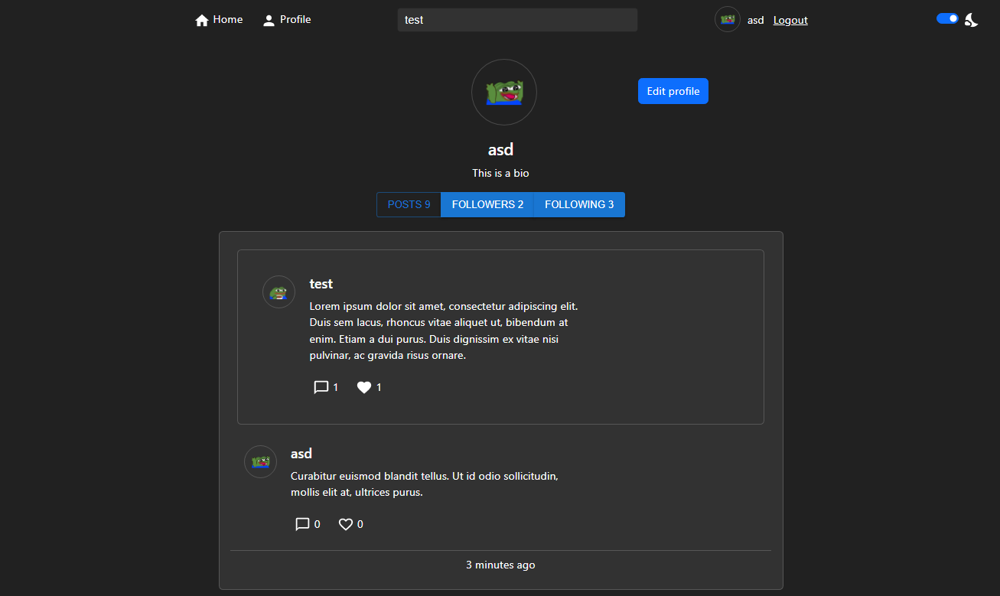
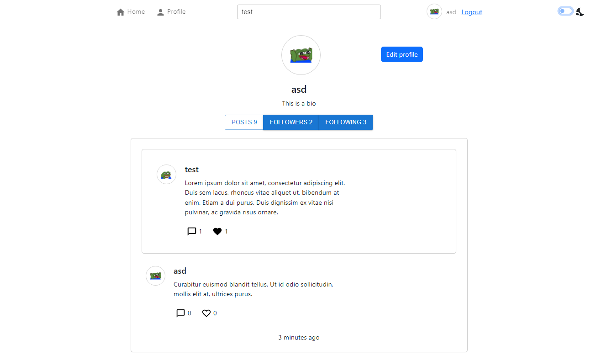
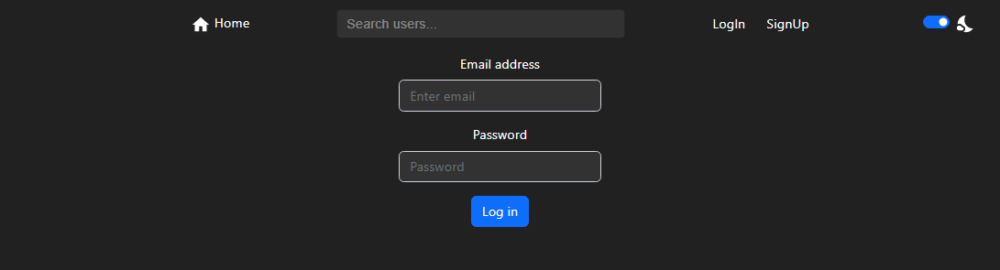
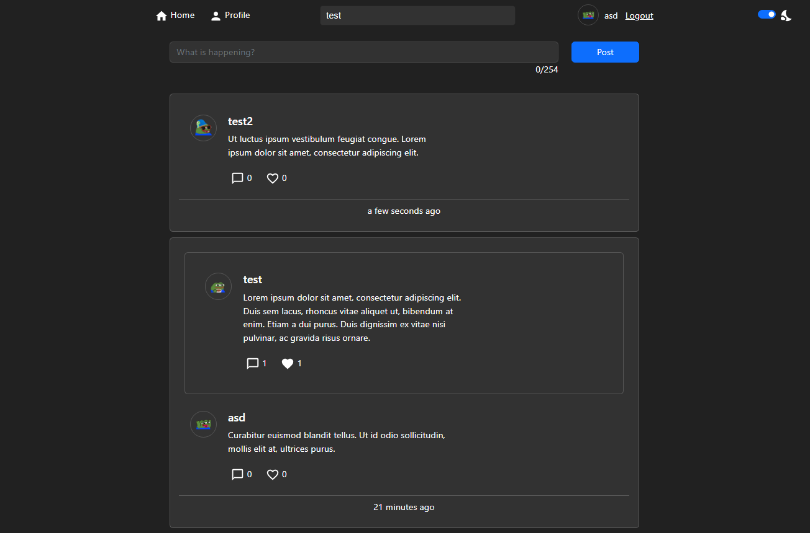
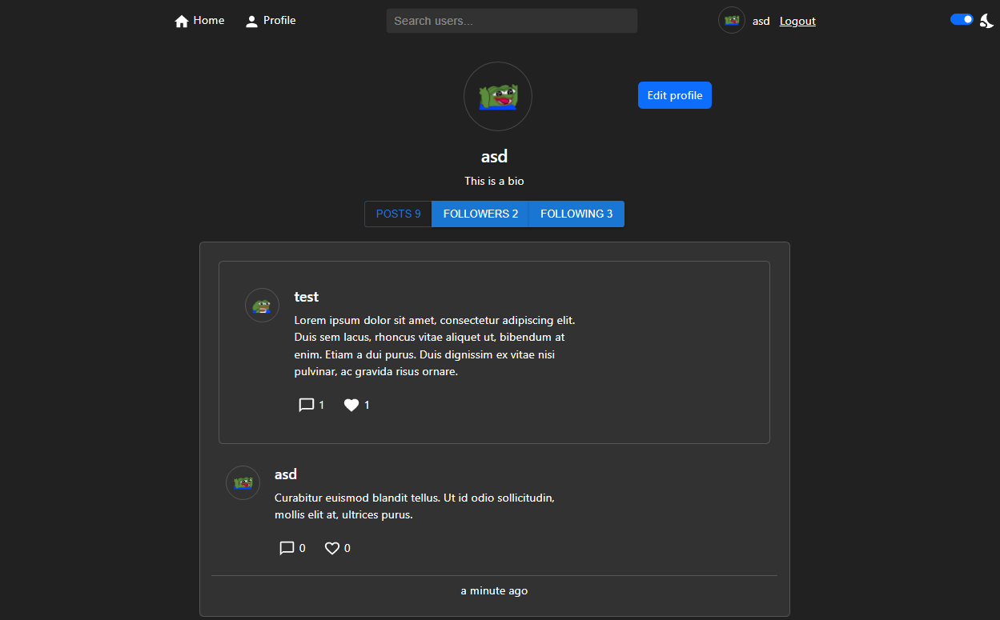
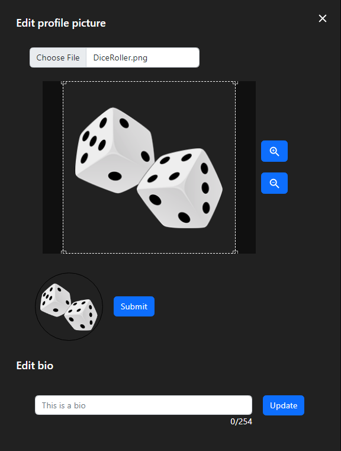
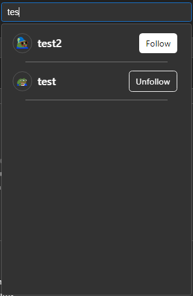

## Available Scripts

In the project directory, you can run:

### `npm start`

Runs the app in the development mode.\
Open [http://localhost:3000](http://localhost:3000) to view it in your browser.

The page will reload when you make changes.\
You may also see any lint errors in the console.

### `npm test`

Launches the test runner for REST api tests.


### Configuring database

create a database:
~~~~sql
CREATE DATABASE database_name
~~~~
add tables for the database:
[Script for creating database tables](./src/Server/create_database.txt);


Required environment variables:
~~~~sql
TOKEN_KEY = "json webtoken key"
DB_NAME = "database_name"
DB_USERNAME = "username"
DB_PASSWORD = "password"
~~~~

## Introduction

|Dark Mode | Light mode|
|---|---|
|||

Signup page


Login page



Home page



Profile page



Editing profile



User search



## REST api description

<table>
<tr>
<td>End point</td><td>HTTP Method</td><td>Description</td><td>Parameters</td><td>Response</td>
</tr>
<tr>
<td>/signup</td><td>POST</td><td>Used for creating an account</td>
<td>

```json
{
    "username": "",
    "email": "",
    "password": ""
}
```
</td>
<td>

```json
{
    "accessToken": "",
    "username": "",
    "user_id": ""
}
```
</td>
</tr>
<tr>
<td>/login</td><td>POST</td><td>Used for logging in and receiving a jsonwebtoken</td>
<td>

```json
{
    "email": "",
    "password": ""
}
```
</td>
<td>

```json
{
    "accessToken": "",
    "username": "",
    "user_id": ""
}
```
</td>
</tr>
<tr>
<td>/post?post_id=</td><td>GET</td><td>Used for retrieving a single post</td>
<td>
Header: authorization<br/>
Query: post_id
</td>
<td>

```json
{
    "post": {
      "user_id":  "",
      "post_id":  "",
      "content":  "",
      "reply_to":  "",
      "created":  "",
      "username":  "",
      "profile_img": "",
      "total_likes":  "",
      "user_like_status":  "",
      "reply_count": ""
    }
}
```
</td>
</tr>
<tr>
<td>/post</td><td>POST</td><td>Used for creating a new post</td>
<td>
Header: authorization<br/>
Body:

```json
{
    "content": "",
    "reply_to": ""
}
```
</td>
<td>
</td>
</tr>
<tr>
<td>/delete/post?post_id=</td><td>DELETE</td><td>Used to delete posts</td>
<td>
Header: authorization<br/>
Query: post_id
</td>
<td>
</td>
</tr>
<tr>
<td>/posts</td><td>GET</td><td>Used for retrieving posts from followed users for homepage</td>
<td>
Header: authorization
</td>
<td>

```json
{
    "posts": [
      {
        "user_id":  "",
        "post_id":  "",
        "content":  "",
        "reply_to":  "",
        "created":  "",
        "username":  "",
        "profile_img": "",
        "total_likes":  "",
        "user_like_status":  "",
        "reply_count": ""
      }
    ]
}
```
</td>
</tr>
<tr>
<td>/user/posts?username=</td><td>GET</td><td>Used for retrieving posts from followed users for homepage</td>
<td>
Header: authorization<br/>
Query: post_id
</td>
<td>

```json
{
    "posts": [
      {
        "user_id":  "",
        "post_id":  "",
        "content":  "",
        "reply_to":  "",
        "created":  "",
        "username":  "",
        "profile_img": "",
        "total_likes":  "",
        "user_like_status":  "",
        "reply_count": ""
      }
    ]
}
```
</td>
</tr>
<tr>
<td>/replies?post_id=</td><td>GET</td><td>Used for retrieving replies for a post</td>
<td>
Header: authorization<br/>
Query: post_id
</td>
<td>

```json
{
    "posts": [
      {
        "user_id":  "",
        "post_id":  "",
        "content":  "",
        "reply_to":  "",
        "created":  "",
        "username":  "",
        "profile_img": "",
        "total_likes":  "",
        "user_like_status":  "",
        "reply_count": ""
      }
    ]
}
```
</td>
</tr>
<tr>
<td>/users?username=</td><td>GET</td><td>Retrieves users matching search parameter</td>
<td>
Header: authorization<br/>
Query: username
</td>
<td>

```json
{
    "users": [
      {
        "user_id":  "",
        "username":  "",
        "profile_img": "",
        "user_follow_status":  ""
      }
    ]
}
```
</td>
</tr>
<tr>
<td>/like</td><td>POST</td><td>Used to like a post</td>
<td>
Header: authorization<br/>
Body:

```json
{
  "post_id":  ""
}
```
</td>
<td>

```json
{
  "total_likes":  "",
  "user_like_status":  ""
}
```
</td>
</tr>
<tr>
<td>/account?username=</td><td>GET</td><td>Used to load profile data of a single user</td>
<td>
Header: authorization<br/>
Query: username
</td>
<td>

```json
{
  "following":  "",
  "followers":  "",
  "posts":  "",
  "isFollowing":  "",
  "user": {
    "username": "",
    "bio": "",
    "profile_img":  "",
    "user_id": ""
  }
}
```
</td>
</tr>
<tr>
<td>/user/followers?username=</td><td>GET</td><td>Used to load followers of a user</td>
<td>
Header: authorization<br/>
Query: username
</td>
<td>

```json
{
  "followers": [
      {
        "username": "",
        "profile_img":  "",
        "user_id": "",
        "user_follow_status": ""
      }
    ]
}
```
</td>
</tr>
<tr>
<td>/user/follows?username=</td><td>GET</td><td>Used to load users that an account follows</td>
<td>
Header: authorization<br/>
Query: username
</td>
<td>

```json
{
  "follows": [
      {
        "username": "",
        "profile_img":  "",
        "user_id": "",
        "user_follow_status": ""
      }
    ]
}
```
</td>
</tr>
<tr>
<td>/user/follow</td><td>POST</td><td>Used to follow or to unfollow a user</td>
<td>
Header: authorization<br/>
Body:

```json
{
  "user_id": "",
  "follow": "true/false"
}
```
</td>
<td>

```json
{
  "user_like_status": ""
}
```
</td>
</tr>
<tr>
<td>/profile_img</td><td>GET</td><td>Used to get the profile image address of the logged in user</td>
<td>
Header: authorization
</td>
<td>

```json
{
  "profile_img": "URL"
}
```
</td>
</tr>
<tr>
<td>/upload/profile_img</td><td>POST</td><td>Used to upload a profile image</td>
<td>
Header: authorization<br/>
Body:

```json
{
  "image": "base64 image"
}
```
</td>
<td>
</td>
</tr>
<tr>
<td>/images?url=</td><td>GET</td><td>Used to retrieve images from the server</td>
<td>
Query: url(filename)
</td>
<td>
File: image
</td>
</tr>
</table>


