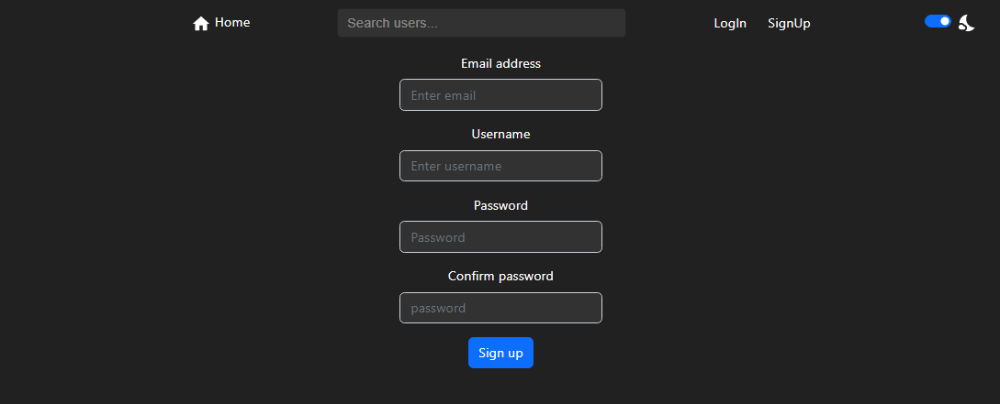

## Available Scripts

In the project directory, you can run:

### `npm start`

Runs the app in the development mode.\
Open [http://localhost:3000](http://localhost:3000) to view it in your browser.

The page will reload when you make changes.\
You may also see any lint errors in the console.

### `npm test`

Launches the test runner for REST api tests.

### Configuring database

create a database:
~~~~sql
CREATE DATABASE database_name
~~~~
add tables for the database:
[Script for creating database tables](./src/Server/create_database.txt);

Required environment variables:
~~~~sql
TOKEN_KEY = "json webtoken key"
DB_NAME = "database_name"
DB_USERNAME = "username"
DB_PASSWORD = "password"
~~~~

## REST api description

| End point | HTTP Method | Description | Parameters | Response |
|---|---|---|---|---|
|/signup|POST|Used for creating an account|username, email, password|accessToken, username, user id|
|/login|POST|Used for logging in and receiving a jsonwebtoken | email, password | accessToken, username, user id|
|/post?post_id=|GET|Used for retrieving a single post|authorization, post_id|user_id, post_id, content, reply_to, created, username, profile_img, total_likes, user_like_status, reply_count|
|/post|POST|Used for creating a new post|authorization, content, reply_to|-|
|/delete/post?post_id|DELETE|Used to delete posts|authorization, post_id|-|
|/posts|GET|Used for retrieving posts from followed users for homepage|authorization|user_id, post_id, content, reply_to, created, username, profile_img, total_likes, user_like_status, reply_count|
|/user/posts?username=|GET|Used for retrieving posts from a user|authorization, username|user_id, post_id, content, reply_to, created, username, profile_img, total_likes, user_like_status, reply_count|
|/replies?post_id=|GET|Used for retrieving replies for a post|authorization, post_id|user_id, post_id, content, reply_to, created, username, profile_img, total_likes, user_like_status, reply_count|
|/users?username=|GET|Retrieves users matching search parameter|(authorization), username|username, user_id, profile_img, (user_follow_status)|
|/like|POST|Used to like a post|authorization, post_id|total_likes, user_like_status|
|/account?username=|GET|Used to load profile data of a single user|authorization, username|following(count) , followers(count) , posts(count) , isFollowing(boolean), user(object)|
|/user/followers?username=|GET|Used to load followers of a user|authorization, username|user_id, username, profile_img, user_follow_status|
|/user/follows?username=|GET|Used to load users that an account follows|authorization, username|username, user_id, profile_img, user_follow_status|
|/user/follow|POST|Used to follow or to unfollow a user|authorization, follow(boolean)|user_follow_status|
|/update/bio|POST|Used to update bio|authorization, content|-|
|/profile_img|GET|Used to get the profile image name of the logged in user|authorization|profile_img|
|/upload/profile_img|POST|Used to upload a profile image|authorization, image(base64)|-|
|/images?url=|GET|Used to retrieve images from the server|url(filename)|image file|

## Introduction

|Dark Mode | Light mode|
|---|---|
|||

Signup page

Login page

Home page

Profile page

Editing profile

User search

